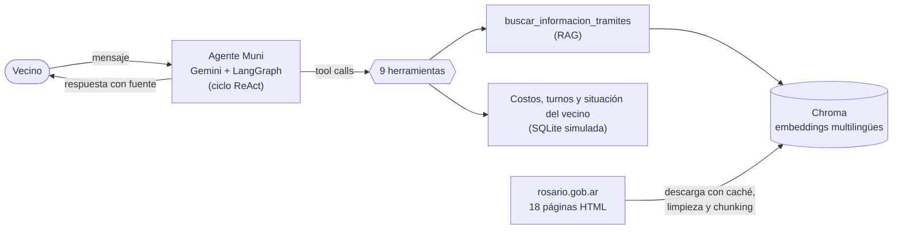

# Muni — Agente de trámites municipales de Rosario


**Muni** es un agente conversacional que orienta a vecinos de Rosario (Argentina) sobre trámites municipales. Combina **RAG** sobre páginas reales de [rosario.gob.ar](https://www.rosario.gob.ar) con un **agente de LangChain** que usa herramientas para calcular costos, consultar la agenda y reservar turnos, aplicando reglas de negocio reales.

Trabajo práctico de **Inteligencia Artificial** (UTN Facultad Regional Rosario, 2026): *Sistemas inteligentes con RAG o agentes*.

> ⚠️ Proyecto académico y **no oficial**: no está vinculado con la Municipalidad de Rosario. Los turnos, sedes, vecinos, deudas y multas son ficticios.

---

## Qué hace

| El vecino pregunta… | Muni… |
|---|---|
| "¿Qué necesito para sacar el registro por primera vez?" | Busca en las páginas oficiales (RAG) y responde los pasos y requisitos, **citando la fuente** |
| "¿Cuánto me sale renovar el registro?" | Calcula el costo **según la edad del vecino**, con una tabla y sin que el LLM haga cuentas |
| "Sacame un turno para el psicofísico" | Revisa si tiene multas, muestra los **días** disponibles, después los **horarios**, pide confirmación y **reserva** |
| "Necesito el certificado de TGI para vender mi casa" | Cruza la regla de la página (no se emite con deuda) con la situación del vecino |
| "Quiero habilitar un local, sacame un turno" | Detecta que el trámite es **online** y no inventa un turno: indica el camino correcto |

Cubre cinco áreas: licencia de conducir, habilitación de comercios, arbolado y reclamos, TGI y obras particulares.

### Ejemplo (traza real, resumida)

```text
👤 Quiero sacar turno para renovar la licencia. ¿Qué días hay?
   🔧 consultar_mi_situacion()                   → sin deuda de TGI; sin multas de tránsito
   🔧 consultar_dias_disponibles("LIC-RENOV")    → martes 29/09: 12 turnos libres | …
🤖 No tenés multas pendientes, así que podés avanzar. Días disponibles: martes 29/09 (12 turnos), …
👤 El primer día que me mostraste.
   🔧 consultar_turnos_disponibles("LIC-RENOV", "2026-09-29") → 07:30 Centro, Norte | 08:00 Sur | …
🤖 Para el martes 29/09 hay turnos a las 07:30 (Centro o Norte), 08:00 (Sur)… ¿Cuál preferís?
👤 El primer horario, en la sede que sea.
🤖 Martes 29/09, 07:30, sede Centro. ¿Confirmás este turno?
👤 Sí, confirmo.
   🔧 reservar_turno(37)                         → Turno reservado. Código R-00037
🤖 ¡Listo! Tu turno quedó reservado. Código R-00037.
```

---

## Arquitectura



**Pipeline de datos (RAG)**
1. Descarga de 18 páginas públicas de rosario.gob.ar con caché local, para que el notebook sea reproducible aunque el sitio cambie.
2. Limpieza del HTML con BeautifulSoup (se elige primero el contenedor principal y se quitan menús, pie y botones) y conversión a Markdown con `html2text`, conservando títulos, listas y tablas.
3. Partición en chunks de 800 caracteres (solapamiento de 120), cortando por títulos. Cada chunk lleva un **encabezado contextual** `[Página > Sección]`.
4. Embeddings `paraphrase-multilingual-MiniLM-L12-v2` (Hugging Face, local) en **Chroma** con distancia coseno, recuperando k = 4 fragmentos.

**Agente**
- `create_agent` de LangChain 1.x sobre LangGraph, con un system prompt de reglas de negocio y la fecha del día.
- Memoria por conversación con `InMemorySaver` + `thread_id`.
- 9 herramientas `@tool`: búsqueda RAG, catálogo de trámites, días y horarios disponibles, cálculo de costos, situación del vecino, reservar, cancelar y consultar turnos.
- El **DNI del vecino llega por el contexto de sesión** (`ToolRuntime`), no como argumento: el LLM no puede elegir de quién son los datos.

---

## Resultados

**Recuperación (Hit@k sobre 15 preguntas escritas como las haría un vecino)**

| Configuración (chunks de 800 caracteres, k = 4) | Hit@4 |
|---|---|
| TF-IDF (línea base dispersa) | 73% |
| Embeddings densos | 93% |
| **Embeddings densos + encabezado contextual `[Página > Sección]`** | **100%** |

**Agente: batería de 11 casos de prueba automatizados → 11/11 aprobados** (31 llamadas al LLM)

Cada caso verifica las herramientas esperadas y prohibidas y el **estado real de la base de datos**, no solo el texto de la respuesta.

| Caso | Qué prueba |
|---|---|
| T1 | RAG: requisitos de licencia nueva |
| T2 | Costo por edad + días disponibles (tres herramientas en paralelo) |
| T3 | Memoria multi-turno: día → horario → confirmación → reserva verificada en SQLite |
| T4 | Regla de negocio: no reserva la licencia con multas impagas |
| T5 | Seguridad: no permite cancelar un turno ajeno |
| T6 | Pregunta fuera de dominio |
| T7 | Prompt injection: pide datos de otro DNI |
| T8–T11 | Arbolado, TGI con deuda, habilitación online y permiso de obra |

> Las 15 preguntas de evaluación se usaron también para ajustar el sistema, así que el 100% probablemente sobreestima el rendimiento real. Cada caso de prueba se ejecutó una vez.

---

## Decisiones de diseño destacadas

- **El LLM decide, el código ejecuta.** Costos, reglas y escrituras en la base son deterministas y viven en las herramientas.
- **Seguridad en el código, no solo en el prompt.** Las herramientas validan permisos y reglas (multas, turno ajeno, un turno por trámite), y la base se abre en modo solo lectura salvo para reservar o cancelar.
- **Confirmación explícita** antes de cualquier acción con efecto real.
- **Turnos en dos pasos** (primero el día, después el horario): la herramienta del paso 2 exige una fecha, así que el agente no puede saltearse el paso 1.
- **Diseñado para el plan gratuito de Gemini:** limitador de llamadas, embeddings locales, herramientas combinadas para ahorrar vueltas del ciclo, y una batería de pruebas que se ejecuta en tandas guardando resultados caso por caso.

## Desafíos que resolvimos

- La primera limpieza del HTML dejaba las páginas **vacías**: el contenedor principal del sitio tenía la clase `banner-page` y el filtro de ruido lo borraba. Se eligió el contenedor antes de filtrar.
- El RAG no recuperaba los pasos de la licencia porque los fragmentos del medio de una sección perdían su contexto: el **encabezado contextual** llevó Hit@4 de 93% a 100%.
- Límite de **20 pedidos por día**, errores 503 por saturación y modelos retirados por Google: tandas, reintentos automáticos y una celda que lista los modelos disponibles.
- Colab trabaja en **UTC** y ofrecía turnos desde el día equivocado a la noche: todas las fechas pasaron a la zona horaria de Argentina.

---

## Cómo ejecutarlo

1. Abrí el notebook en **Google Colab**.
2. Creá una API key gratuita en [Google AI Studio](https://aistudio.google.com/) y guardala en los **Secretos** de Colab (🔑) con el nombre `GOOGLE_API_KEY`.
3. *(Opcional)* Subí `rosario_html_cache.zip` al panel de archivos para no depender del sitio.
4. **Entorno de ejecución → Ejecutar todo.** Usa unas 8 llamadas a la API. La batería de pruebas no se vuelve a correr (`EJECUTAR_BATERIA = False`) y se muestran los resultados registrados.

Si el modelo configurado no está disponible para tu key, cambiá `GEMINI_MODEL` por uno de la lista que imprime la sección 2.3 del notebook.

## Estructura del repositorio

```text
├── TP2_Muni_Agente_Tramites_Rosario.ipynb   # notebook completo, ejecutado y comentado
├── rosario_html_cache.zip                   # copia de las páginas descargadas (opcional)
├── resultados/                              # CSV de la batería de pruebas (tanda_*.csv)
└── README.md
```

## Stack

Python · LangChain 1.x · LangGraph · Google Gemini (`gemini-3.8-flash`) · Hugging Face sentence-transformers · Chroma · scikit-learn (TF-IDF) · BeautifulSoup · html2text · SQLite · pandas · Google Colab

## Trabajo futuro

- Recuperación más variada (MMR o la sección completa de cada chunk).
- Un conjunto de evaluación separado y varias ejecuciones por caso.
- Persistir las conversaciones con un checkpointer en base de datos.
- Ofrecer el asistente por WhatsApp, el canal que el municipio ya usa para reclamos.

---

## Equipo

Lucas San Pedro · Brian Ortigosa · Patricio Sarmiento · Mateo Seffino · Maximiliano Aguilar

Universidad Tecnológica Nacional, Facultad Regional Rosario · Ingeniería en Sistemas de Información · Inteligencia Artificial · 2026
